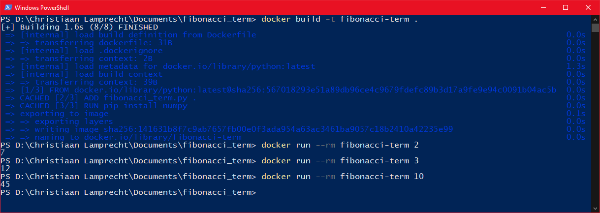

<div id="top"></div>

# Fibonacci Term Finder

<!-- ABOUT THE PROJECT -->
## About The Project
In this project, a python script is run via a Docker container. This script's function is to find the index of the first element in the Fibonacci sequence to have the number of digits as the input value.

<br/><p align="right">(<a href="#top">back to top</a>)</p>

<!-------------------------------------------------->

<!-- GETTING STARTED -->
## Getting Started
This section goes over the instructions to set up, build and run the script via the Docker container. 
<br/><br/>

### 1. Run Docker
In case you do not yet have Docker on your machine. You must first set up Docker. Instructions on setting up and running Docker can be found in the [Docker documentation](https://docs.docker.com/).
<br/>

### 2. Extracting the build files
Extract the files from the archive to the directory you desire.
<br/>

### 3. Open the Command line
From the command line, navigate to the directory where you have chosen to extract the archive content.
<br/>

1. Build the Docker image <br/>
To build the Docker image of the files in the current directory, you can run the following command on your command line.
    ```sh
    docker build -t fibonacci-term .
    ```
<br/>

2. Run the Docker image in a container <br/>
To run the Docker image from the command line, you could use the following command, where the `<input>` refers to the `input value`.
    ```sh
    docker run --rm fibonacci-term <input>
    ```
    In this case, the `fibonacci-term` is the Docker image name. The `--rm` makes Docker _automatically clean up the container and remove the file system when the container exits_, as discussed in the [Docker documentation](https://docs.docker.com/engine/reference/run/#clean-up---rm).

<br/><p align="right">(<a href="#top">back to top</a>)</p>


<!-- USAGE EXAMPLES -->
## Usage Example
The terminal should somewhat resemble the image below when done with the section above.
<br/><br/>
<div align="center">

<p align="center">PowerShell Output</p>
</div>

<br/><p align="right">(<a href="#top">back to top</a>)</p>


<!-- CONTACT -->
## Contact
_Johan Christiaan Lamprecht - christiaan3597@gmail.com_

<br/><p align="right">(<a href="#top">back to top</a>)</p>


